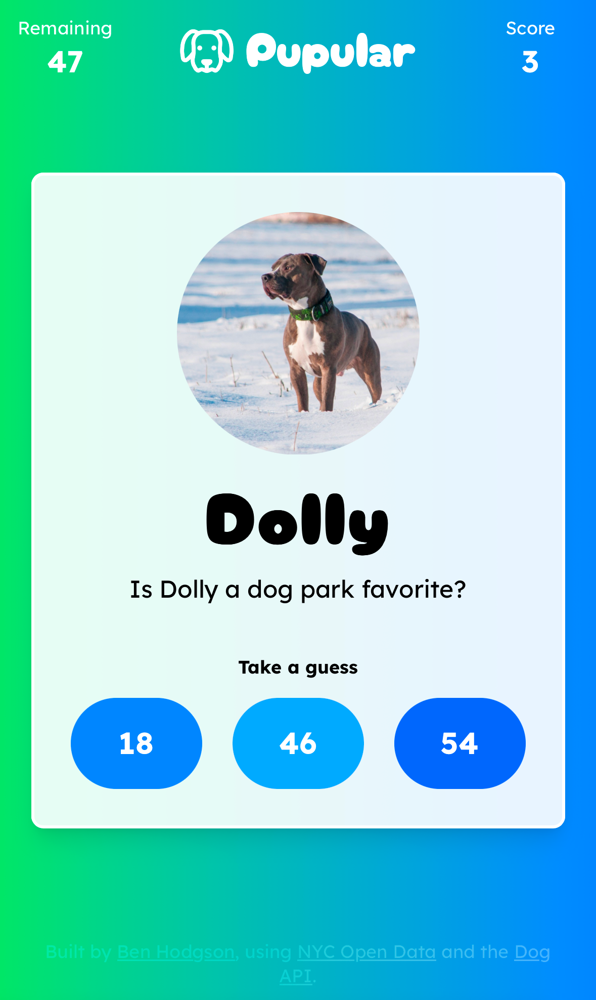
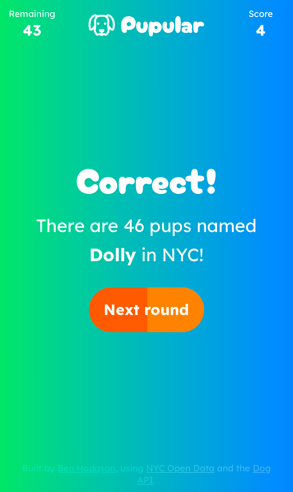

# Pupular

https://pupular.name

Pupular is a fun game built using NYC's [open data set of licensed dogs](https://data.cityofnewyork.us/Health/NYC-Dog-Licensing-Dataset/nu7n-tubp/about_data), where you have to guess correctly how many dogs have the same name within one minute.

|                                                     |                                             |                                                            |                                                  |
| --------------------------------------------------- | ------------------------------------------- | ---------------------------------------------------------- | ------------------------------------------------ |
|  |  |  |  |

It's built on [Remix](https://remix.run/), and hosted on [Netlify](https://www.netlify.com/). Data is handled via Netlify edge functions and [Upstash](https://upstash.com) Redis, with animations powered by [Motion](https://motion.dev), and future support for translation through [remix-i18next](https://github.com/sergiodxa/remix-i18next).

## How it works

The licenses dataset is a bit of a mess, with historical entries for long expired licenses, and some dogs with multiple entries for current licenses. With some processing the data has been converted to fairly unique individual entries and reduced into a set of counts for each name, along with some currently unused additional metadata for individual breed counts, and gender splits.

In total almost 617,000 entries in the original CSV have been reduced down to 9,397 individual name records; 1,622 of which belong to only one dog.

This data was then pushed up to Redis where it can be queried via `RANDOMKEY` to get a random entry for each round.

The correct answer is combined with two other randomly generated similar values on the edge and returned to the user, alongside an image pulled from the [Dog API](https://dog.ceo/api).

The user then submits their answer and it is checked against the correct count and returned for the user's score to be updated.

The state and gameplay functionality is handled in a central React context provider, and new high scores are persisted to a cookie for later use.

## Future functionality

- Present interesting facts from breed/gender data on the answer screen
- Generate images for social sharing of high scores
- Hard mode; limit time user has to select an answer, options are all within 1 of the correct count
- Impossible mode; no options presented, just a text input to guess the correct count (maybe with a hint)

## Fork and contribute

If you want to fork this and see what other weird cool stuff you can build with the data, I'd love to see it.

Equally if you have ideas for functionality or fixes and want to contribute, pull requests are welcomed.

Please ensure your development environment is set up to use [Biome](https://biomejs.dev/) for formatting and linting.
