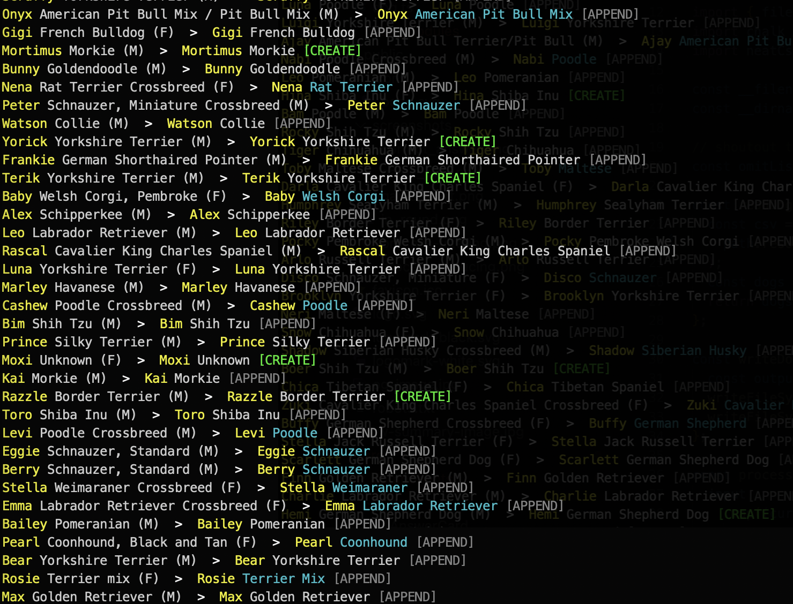

# Pupular

https://pupular.name

Pupular is a fun game built using NYC's [open data set of licensed dogs](https://data.cityofnewyork.us/Health/NYC-Dog-Licensing-Dataset/nu7n-tubp/about_data), where you have to guess correctly how many dogs have the same name within one minute.

|                                                     |                                             |                                                            |                                                  |
| --------------------------------------------------- | ------------------------------------------- | ---------------------------------------------------------- | ------------------------------------------------ |
|  |  |  |  |

It's built on [Remix](https://remix.run/), and hosted on [Netlify](https://www.netlify.com/). Data is handled via Netlify edge functions and [Upstash](https://upstash.com) Redis, with animations powered by [Motion](https://motion.dev), and future support for translation through [remix-i18next](https://github.com/sergiodxa/remix-i18next).

## How it was built

The licenses dataset is a bit of a mess, with historical entries for long expired licenses, some dogs with names like "Unknown" and "Name not provided, and others with multiple entries for currently valid licenses.

With some processing the data has been converted to reasonably unique individual entries and reduced into a set of counts for each name, along with additional metadata for individual breed counts for each name, and gender counts.

For example the CSV contains the following data, with some noticeable commonalities;

```csv
AnimalName,AnimalGender,AnimalBirthYear,BreedName,ZipCode,LicenseIssuedDate,LicenseExpiredDate,Extract Year
SACHEL,M,2008,Shih Tzu Crossbreed,10016,01/14/2016,01/14/2017,2016
SACHEL,M,2007,Shih Tzu,10016,12/28/2016,12/28/2021,2016
SACHEL,M,2007,Shih Tzu,10016,04/09/2022,12/28/2024,2023
SACHEL,M,2007,Shih Tzu,10016,10/19/2023,12/28/2025,2023
SACHEL,M,2007,Shih Tzu,10016,10/19/2023,12/28/2025,2023
```

This data is processed via a Node script.

The processing logic and input/outputs for this [can be found in the lib folder](./lib/data/). Don't use it to cheat!

| Filtering data                                                | Reducing data                                               |
| ------------------------------------------------------------- | ----------------------------------------------------------- |
|  |  |

This results in the following output, where the expired licenses have been omitted, and the three currently valid licenses have been combined to a single entry, as there are obvious matches in the name, gender, birth year, breed and ZIP code fields.

```json
{
  "name": "Sachel",
  "count": 1,
  "breeds": {
    "Shih Tzu": 1
  },
  "genders": {
    "M": 1
  }
}
```

In total there are 616,890 entries in the original data, which reduce down to 43,066 individual 'valid' dogs with 9,397 unique name records; 1,622 of which belong to only one dog.

This data was then fed into Redis where it can be queried via `RANDOMKEY` to get a (mostly) random entry for each round. Redis does occasionally return the same key again within a short timeframe.

The correct answer is combined with two other randomly generated values with some logic to keep them feasibly similar and returned to the user, alongside an image pulled from the [Dog API](https://dog.ceo/api).

The user then submits their answer and it is checked against the correct count and returned for the user's score to be updated.

The state and gameplay functionality is handled in a central React context provider, and new high scores are persisted to a cookie for later use.

## Future functionality

- Present interesting facts from breed/gender data on the answer screen
- Generate images for social sharing of high scores
- Hard mode; limit time user has to select an answer, options are all within 1 of the correct count
- Impossible mode; no options presented, just a number input to guess the correct count (give the option to use a hint to sacrifice points)

## Fork and contribute

If you want to fork this and see what other weird cool stuff you can build with the data, I'd love to see it.

Equally if you have ideas for functionality or fixes and want to contribute, pull requests are welcomed.

Please ensure your development environment is set up to use [Biome](https://biomejs.dev/) for formatting and linting.
